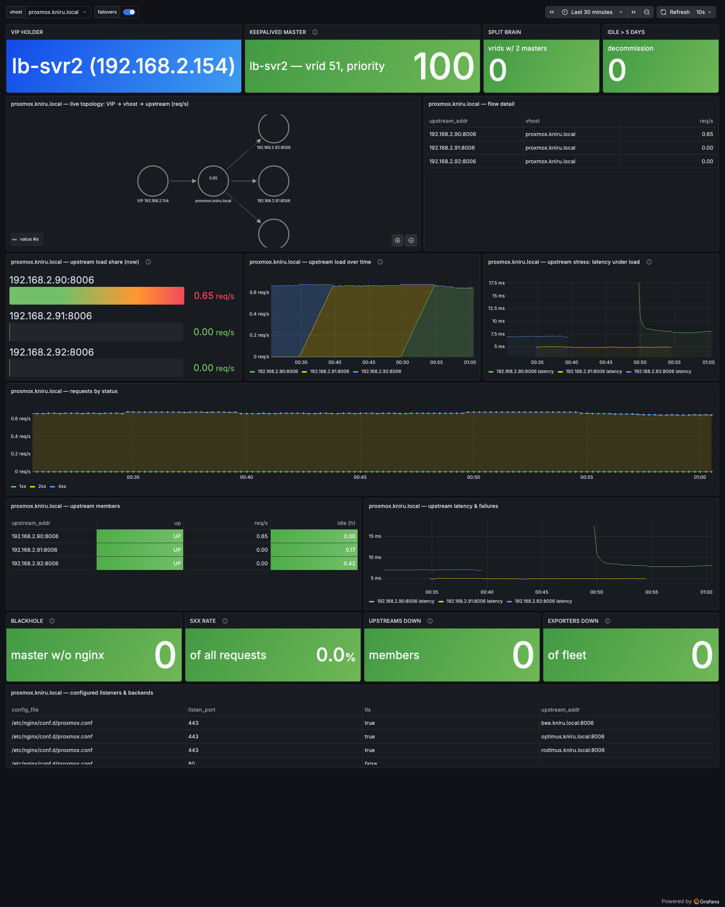
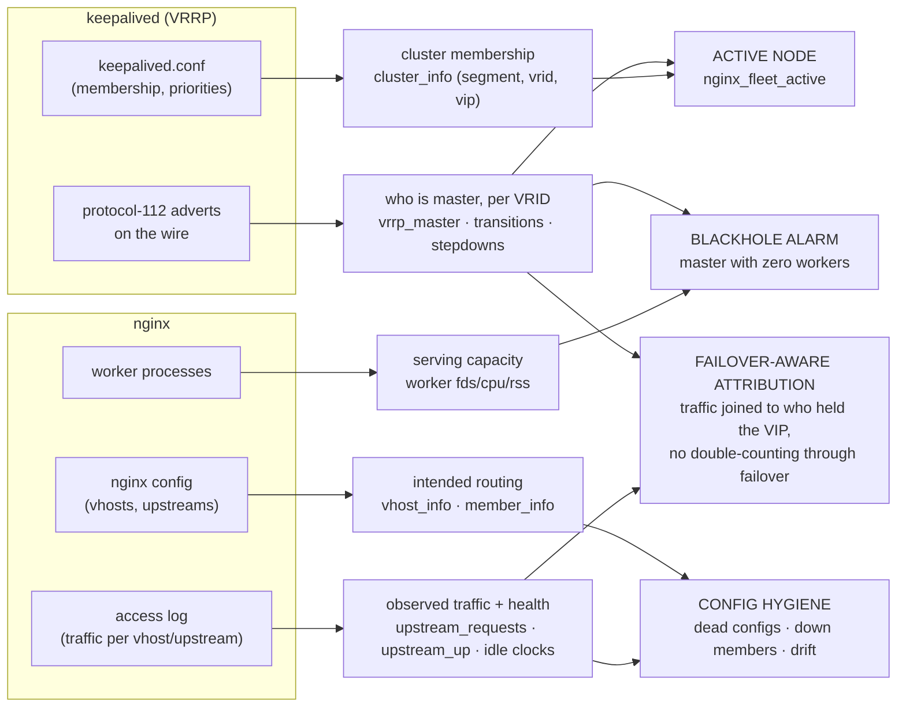

# nginx-fleet-exporter

[](https://github.com/kifediniru393/nginx-fleet-monitor/actions/workflows/ci.yml) [](LICENSE) [](https://goreportcard.com/report/github.com/techmoose/nginx-fleet-exporter)



**A single-binary Prometheus exporter for nginx fleets running keepalived HA pairs — cluster identity from the wire, traffic attribution per vhost and upstream, and empirical config hygiene.**

Standard exposition format on one `/metrics` endpoint. No runtime dependency on any other exporter or agent. Written in Go with only the Prometheus client and `x/sys` as dependencies.

---

## The problem

If you run nginx on VMs (not Kubernetes), fronted by keepalived VIPs, with multiple
`server_name`s proxying to shared backends, these questions are surprisingly hard to
answer with today's tooling:

1. **Who is the active node right now?** Prometheus sees `nginx-1` and `nginx-2` as two
   unrelated hosts. It has no concept of "this pair is one serving entity," so you can't
   reason about failovers, headroom, or moving a vhost to another cluster.
2. **Which vhost generates which share of the load?** Multiple sites share one backend
   IP; at the network level everything collapses onto that tuple.
3. **Which upstream members actually receive traffic — and which are silently down?**
   Config says three members; is nginx really sending to all three?
4. **Which configs are dead?** Every long-lived fleet accumulates vhosts and upstreams
   that serve no traffic. Nobody dares delete them because nobody can prove they're unused.

Today the answer to all four is "SSH into the box." This exporter exists to make them
Prometheus queries instead.

## How it compares to existing tools

| | vhost traffic | per-upstream traffic + health | VRRP cluster identity | failover capture | dead-config detection | runtime deps | nginx config changes |
|---|---|---|---|---|---|---|---|
| `nginx-prometheus-exporter` (official) | ✗ (totals only, from `stub_status`) | ✗ | ✗ | ✗ | ✗ | — | `stub_status` location |
| `nginx-module-vts` | ✓ | ✓ | ✗ | ✗ | ✗ | module compile | module + directives |
| `prometheus-nginxlog-exporter` | ✓ | partial | ✗ | ✗ | ✗ | — | `log_format` |
| keepalived exporters (`gen2brain`, `mehdy`, `cafebazaar`) | ✗ | ✗ | **self-report only** | partial | ✗ | some need `--enable-json` builds | — |
| nginx Plus | ✓ | ✓ | ✗ | ✗ | ✗ | commercial licence | `status_zone` |
| **nginx-fleet-exporter** | ✓ | ✓ | **✓ from the wire** | ✓ | ✓ | none | two additive drop-in files |

> **Drop-in replacement:** with `--stub.scrape-uri` set, this exporter also emits the official exporter's exact metric names (`nginx_up`, `nginx_connections_*`, `nginx_http_requests_total`) from `stub_status` — existing dashboards and alerts written for `nginx-prometheus-exporter` keep working unchanged, and its separate process can be retired. Verified against the official "NGINX by nginxinc" Grafana dashboard.

Two gaps in the existing landscape drove this project:

**Every keepalived exporter trusts keepalived's self-report** — SIGUSR1/2 state dumps or
the JSON interface. If keepalived is wrong, wedged, or split-brained, its self-report is
exactly what you cannot trust. This exporter instead **listens to VRRP advertisements on
the wire** (IP protocol 112, the same packets the routers exchange) and derives master
state from ground truth. The node best positioned to report a master's death is never the
dead master — with every node observing the wire, the standby records the takeover even
while the old master's exporter dies with it.

**Nobody joins traffic attribution to cluster identity.** Per-vhost metrics exist (VTS,
log exporters); what doesn't exist is the composition: *this vhost pushed this many bytes
to this upstream member, through the node that held this VIP at this moment* — with no
double-counting through a failover. That composition is the point of this exporter.

### Design principle

> **Observe the network, don't interrogate the box.**

Config parsing tells us intent. The wire and the access log tell us truth. Self-report —
keepalived's or nginx's — is an input to be cross-checked, never a source of authority.
The same principle applied to configuration gives the hygiene layer: a vhost exists when
traffic proves it, not when a config file claims it.

---

## Architecture

One Go binary, one systemd unit, modular collectors that **degrade independently** — any
collector failing (no keepalived, unreadable log, DNS outage, permission denied) reports
itself as a metric and leaves the rest serving:

| Collector | Enabled | Source | Provides |
|---|---|---|---|
| `config` | always | `nginx -T`, falling back to parsing `/etc/nginx/nginx.conf` from disk with `include` resolution | intended topology: vhost × listener × upstream member, worker limits |
| `workers` | always (Linux) | `/proc` | per-worker fds, CPU, RSS |
| `ingress` | `--ingress.access-log` | dedicated JSON access log (additive drop-in) | per-vhost and per-upstream traffic, failures, latency, idle clocks |
| `vrrp` | `--vrrp` (auto-detect) | AF_PACKET capture of protocol-112 adverts | master per VRID, failover transitions, stepdown early-warning |
| keepalived membership | automatic | local `keepalived.conf` | cluster membership incl. silent standbys, L2 segment identity |
| stub | `--stub.scrape-uri` | nginx `stub_status` (additive drop-in) | official-exporter-compatible metrics + live connection-state gauges |
| TLS probe | automatic | SNI handshake against the local listener | per-vhost cert expiry and SAN match — the cert *actually served*, per node; catches expiry, wrong-cert-served, and drift between HA pair members |

Notable implementation details:

- **VRRP parser** branches on the version nibble before trusting any offset: v2 carries
  its interval in whole seconds and checksums the entire message including auth data
  (RFC 3768); v3 uses 12-bit centiseconds and a pseudo-header checksum. Validated against
  a checked-in capture of real keepalived adverts — the fixture that caught a checksum-scope
  bug synthetic tests missed.
- **AF_PACKET rather than a multicast group join**, so `unicast_peer` deployments are
  visible too.
- **DNS resolution decoupled from scrapes**: upstream hostnames resolve in a background
  loop; an outage keeps last-known mappings (matching nginx's own reload-cached behavior)
  and recovery self-heals within a minute.
- **Idle clocks persist across restarts** (atomic JSON state file) and configured-but-
  never-used vhosts/upstreams are seeded with a "watching since" timestamp — so dead
  config alerts even if it never served a single request, and a weekly restart can't
  reset a decommission clock.
- **Hardened by default**: single capability (`CAP_NET_RAW`), strict systemd sandbox,
  HTTP timeouts, bounded label cardinality (`_other` bucket for vhosts, capped VRRP
  transition pairs against advert-spoofing floods, negative-value guards on log input).

### Every VRRP observation is labeled with its observer

```
nginx_fleet_vrrp_master{vrid="51", node="192.168.2.153", vip="192.168.2.154", observer="lb-svr2"} 1
```

reads: *"lb-svr2 heard, on the wire, that .153 is master."* All nodes observe all adverts,
so you get N independent accounts of the same fact. Observers disagreeing is not noise —
it's a network partition, visible from both sides.

---

## How nginx and keepalived correlate

The exporter's core value is joining two worlds that are normally monitored separately —
keepalived's **cluster state** and nginx's **serving state** — on every node, continuously:



The four joins, concretely:

1. **Active node** — `nginx_fleet_active{node, method="vrrp"}` is derived by checking
   whether the wire-observed master's IP belongs to this node. Every "is this VM serving?"
   dashboard question is one gauge, valid across failovers.
2. **Blackhole detection** — mastership and serving are deliberately separate signals, and
   their *disagreement* is the alert: a node that holds the VIP (`vrrp_master == 1`) with
   zero nginx worker processes is receiving traffic and serving nothing. Stock keepalived
   without a `vrrp_script` tracking nginx will happily sit in this state forever; the
   exporter makes it a red number on the wall. (The deploy docs include the
   `vrrp_script`/priority-weight pattern that turns this from an alert into an automatic
   failover — and the exporter then shows the priority dropping as the health check demotes
   the node.)
3. **Failover-aware traffic attribution** — cluster rollups join per-vhost/per-upstream
   traffic against `vrrp_master == 1` on the VRID rather than summing across nodes, so
   "who served this traffic through which VIP" stays correct through a failover: the old
   master's counters stop, the new master's start, transitions are counted exactly once,
   and the Grafana failover annotations line the two up visually.
4. **Config hygiene** — nginx intent (configured vhosts/members) diffed against nginx
   observation (traffic, failures), with keepalived context deciding *where* those
   configs should be serving from.

The correlation is also why the exporter runs on **every** node of a pair, standby
included: backups are silent in VRRP, so the standby's exporter is both the witness that
records a master's death (its own exporter dies with it) and the proof that the standby's
nginx is warm and ready *before* the VIP arrives.

## Quick start

```sh
# CGO_ENABLED=0 is required: it produces a fully static binary that runs on
# any glibc version. A native Linux build without it links the build host's
# glibc and fails on older targets with "GLIBC_X.YY not found".
CGO_ENABLED=0 GOOS=linux GOARCH=amd64 go build -o nginx-fleet-exporter ./cmd/nginx-fleet-exporter

# per host — every step is additive; no existing config file is edited
scp nginx-fleet-exporter          root@HOST:/usr/local/bin/
scp deploy/nginx-fleet-exporter.service root@HOST:/etc/systemd/system/
scp deploy/zz-fleet-logging.conf  root@HOST:/etc/nginx/conf.d/   # ingress log drop-in
scp deploy/zz-stub-status.conf    root@HOST:/etc/nginx/conf.d/   # stub_status endpoint (access_log off — keeps self-monitoring out of attribution)
scp deploy/fleet-logrotate        root@HOST:/etc/logrotate.d/nginx-fleet
ssh root@HOST '
  useradd -r -s /usr/sbin/nologin nginx-exporter; usermod -aG adm nginx-exporter
  nginx -t && nginx -s reload
  systemctl daemon-reload && systemctl enable --now nginx-fleet-exporter'

curl -s http://HOST:9942/metrics | grep nginx_fleet_
```

The logging drop-in works because stock nginx setups `include /etc/nginx/conf.d/*.conf`
inside `http {}`, and nginx writes to *every* configured `access_log` — existing logs
continue untouched; deleting the drop-in fully reverts. Boundary: a `server` block that
declares its own `access_log` overrides the http-level one and won't appear in the fleet log.

## Flags

| Flag | Default | Description |
|---|---|---|
| `--web.listen-address` | `:9942` | Address for the `/metrics` endpoint. |
| `--nginx.t-command` | `nginx -T` | Command that produces the assembled running config. `nginx -T` validates TLS key files, which an unprivileged exporter may not be able to read — hence the fallback below. |
| `--nginx.config` | `/etc/nginx/nginx.conf` | On-disk config parsed (with recursive `include` glob resolution) when the command above fails. Empty string disables the fallback. Tradeoff: disk config can be newer than the running one if a reload hasn't happened. |
| `--nginx.config-interval` | `60s` | Minimum interval between config re-parses. Parsing never happens on the scrape path. |
| `--vrrp` | `auto` | VRRP module: `on`, `off`, or `auto` (module activates once protocol-112 adverts are heard). Off/absent/unprivileged all degrade to `nginx_fleet_vrrp_enabled 0` with everything else unaffected. |
| `--keepalived.config` | `/etc/keepalived/keepalived.conf` | Local keepalived config parsed for cluster membership (`cluster_info`) and unicast detection. A missing file is a normal state, not an error. |
| `--ingress.access-log` | *(empty = collector off)* | Path to the fleet JSON access log (see `deploy/zz-fleet-logging.conf`). The tailer starts at end-of-file (no double-count on restart), survives logrotate (inode change) and truncation, and retries if the file disappears. |
| `--ingress.max-vhosts` | `500` | Distinct vhost label values before new ones fold into `_other`. Protects Prometheus from cardinality explosions via wildcard `server_name` + hostile SNI/Host values. |
| `--ingress.state-file` | `/var/lib/nginx-fleet-exporter/state.json` | Persistence for the last-traffic idle clocks (periodic + shutdown save, atomic write). Empty disables. The systemd unit provides the directory via `StateDirectory=`. |
| `--stub.scrape-uri` | *(empty = off)* | nginx `stub_status` URL. Emits official-exporter-compatible metrics; pairs with `deploy/zz-stub-status.conf`. Note: this is the one collector doing I/O on the scrape path (a loopback GET, ~10 ms) — connection gauges are instantaneous values. |
| `--decommission-window` | `120h` | Idle window after which a vhost/upstream is a decommission candidate. Informational: exported as `nginx_fleet_decommission_window_seconds` and consumed by the alert rules, so the threshold lives in exactly one place. |

## Metrics reference

<details>
<summary><b>Cluster identity (vrrp module + keepalived membership)</b></summary>

| Metric | Labels | Meaning |
|---|---|---|
| `nginx_fleet_vrrp_enabled` | — | 1 if the passive listener is running |
| `nginx_fleet_vrrp_master` | vrid, node, vip, observer | 1 if `node` last advertised as master and is within its master-down interval |
| `nginx_fleet_vrrp_priority` | vrid, node, observer | advertised priority of the current master (watch it drop when a health-check demotes a node) |
| `nginx_fleet_vrrp_advert_interval_seconds` | vrid, observer | advertised interval |
| `nginx_fleet_vrrp_advert_version` | vrid, observer | VRRP protocol version on the wire (2 or 3) |
| `nginx_fleet_vrrp_last_advert_age_seconds` | vrid, node, observer | staleness; observers diverging here = partition signal |
| `nginx_fleet_vrrp_transitions_total` | vrid, from_node, to_node, observer | failovers, counted exactly once per direction (empty `from_node` = initial election) |
| `nginx_fleet_vrrp_stepdowns_total` | vrid, observer | graceful priority-0 stepdowns (edge-counted): the "VIP is about to move" early warning |
| `nginx_fleet_vrrp_stepdown` | vrid, node, observer | instantaneous stepdown gauge (often too brief to scrape — use the counter) |
| `nginx_fleet_vrrp_transitions_dropped_total` | observer | transition observations discarded by the cardinality cap (advert-spoofing flood guard) |
| `nginx_fleet_cluster_info` | vrid, vip, member_node, instance, segment | membership from local keepalived.conf; passive VRRP cannot see silent backups, so membership comes from config, mastership from the wire. Group clusters by `(segment, vrid)` — VRIDs are only unique per L2 segment |
| `nginx_fleet_vrrp_unicast_configured` | vrid, instance | 1 if the instance uses `unicast_peer` |
| `nginx_fleet_active` | node, method | 1 if this node is currently serving (`method="vrrp"` from master state; `"static"` when no VRRP) |

</details>

<details>
<summary><b>Topology (config collector)</b></summary>

| Metric | Labels | Meaning |
|---|---|---|
| `nginx_fleet_vhost_info` | vhost, listen_addr, listen_port, tls, upstream_addr, config_file | intended routing graph from the running config |
| `nginx_fleet_upstream_member_info` | vhost, upstream_addr, upstream_ip | configured member with its DNS-resolved address — the join between config-side hostnames and the resolved IPs observed in logs |
| `nginx_fleet_worker_processes` / `nginx_fleet_worker_connections_limit` | — | configured capacity (`worker_processes auto` reports 0; count per-pid series instead) |
| `nginx_fleet_config_parse_errors_total` | — | failures of both `nginx -T` and the disk fallback |

</details>

<details>
<summary><b>Traffic & hygiene (ingress collector)</b></summary>

| Metric | Labels | Meaning |
|---|---|---|
| `nginx_fleet_ingress_enabled` | — | 1 if the log tailer is running |
| `nginx_fleet_ingress_requests_total` | vhost, status_class | requests per vhost by 2xx/3xx/4xx/5xx |
| `nginx_fleet_ingress_bytes_total` | vhost, direction | L7 bytes (`$bytes_sent` / `$request_length`) |
| `nginx_fleet_ingress_unattributed_total` | reason | lines that couldn't be attributed (`parse_fail`, `no_host`) — silent mis-attribution is worse than no attribution |
| `nginx_fleet_upstream_requests_total` | vhost, upstream_addr | requests per upstream member, **including retried attempts** — a member hammered by `proxy_next_upstream` retries shows its true received load |
| `nginx_fleet_upstream_failures_total` | vhost, upstream_addr, reason | empirical failures: `next_upstream` (skipped mid-request), `http_502/503/504`, per member |
| `nginx_fleet_upstream_response_seconds` | vhost, upstream_addr | **histogram** of `$upstream_response_time` (default buckets) — per-member percentiles via `histogram_quantile()` |
| `nginx_fleet_upstream_up` | vhost, upstream_addr | 1 if the most recent evidence for the member is a success; a later success flips a down member back up |
| `nginx_fleet_vhost_last_traffic_timestamp_seconds` | vhost | idle clock per vhost |
| `nginx_fleet_upstream_last_traffic_timestamp_seconds` | vhost, upstream_addr | idle clock per member; configured-but-never-used entries are seeded with "watching since", never-observed entries that leave the config are pruned |
| `nginx_fleet_decommission_window_seconds` | — | the configured `--decommission-window`, for rules to reference |

</details>

<details>
<summary><b>TLS certificates (probe)</b></summary>

| Metric | Labels | Meaning |
|---|---|---|
| `nginx_fleet_vhost_cert_expiry_timestamp_seconds` | vhost, listen_port | NotAfter of the cert actually served (probed hourly via SNI) |
| `nginx_fleet_vhost_cert_san_match` | vhost, listen_port | 0 = the vhost serves a certificate not valid for its own name |
| `nginx_fleet_vhost_cert_probe_failed` | vhost, listen_port | TLS handshake failed entirely |

Because every node probes its own listener, the same vhost appearing with
different expiry values across nodes is **certificate drift between pair
members** — invisible to clients until a failover swaps which cert they get.

Listeners bound to a specific address (`listen <VIP>:443`) are probed at that
address, but **only while this node holds it** — on the standby the VIP isn't
local, and dialing it would reach the master's certificate and mislabel it, so
those probes are skipped rather than mis-reported. Consequence: for VIP-bound
listeners, cert series exist only on the current master.
(This probe found exactly that, first hour deployed: a standby serving a cert
expired five months earlier.)

</details>

<details>
<summary><b>Official-exporter compatibility (stub collector)</b></summary>

`nginx_up`, `nginx_connections_{accepted,handled,active,reading,writing,waiting}`,
`nginx_http_requests_total` — same names and semantics as
`nginx-prometheus-exporter`, sourced from `stub_status`.

</details>

<details>
<summary><b>Workers (Linux)</b></summary>

`nginx_fleet_worker_fds_open`, `nginx_fleet_worker_fds_limit`,
`nginx_fleet_worker_cpu_seconds_total`, `nginx_fleet_worker_rss_bytes` — all per `pid`.

</details>

## Alerting & aggregation

`rules/hygiene.yml` ships Prometheus/VictoriaMetrics rules for:

- **Decommission candidates** — vhosts/upstreams idle past the window (default 5 days).
  Make sure the window exceeds your longest legitimate quiet period (monthly batch jobs)
  before acting on candidates.
- **Down upstreams** — `upstream_up == 0` from observed evidence.
- **Intent-vs-actual drift** — configured members receiving no traffic while their vhost
  serves; traffic flowing to addresses no configured member resolves to.
- **VRRP split brain** — two masters on one VRID.
- **No healthy standby** (critical) — a cluster has fewer than 2 members with a
  running nginx: a failover now would blackhole the VIP. Catches the classic
  silent state after a boot-time failure on the standby.
- **TLS**: cert expiring within 14 days, vhost serving a cert not valid for its
  own name, and **cert drift** — pair members serving different certificates
  for the same vhost.

Evaluate them with vmalert + Alertmanager (or Prometheus). Rule changes ship
with `deploy/deploy-rules.sh <user@vmalert-host>`.

Cluster-level queries at fleet scale:

```promql
count by (segment, vrid) (nginx_fleet_cluster_info)                # every cluster + members
max by (segment, vrid, node) (nginx_fleet_vrrp_master) == 1        # current master per cluster
count by (segment, vrid) (nginx_fleet_cluster_info) < 2            # clusters missing a standby
nginx_fleet_active{method="vrrp"}                                  # which of N nodes is serving
count(nginx_fleet_active == 1 unless on (instance) nginx_fleet_worker_fds_open)  # VIP blackhole: master with no nginx
```

## Grafana dashboard

`deploy/grafana-dashboard.json` — import via UI or API. Three tiers:

- **NOC wall**: VIP holder (hostname + address), current master with live priority,
  split-brain / blackhole / idle-config alarms readable across a room.
- **Live topology**: node graph of `VIP → vhost → upstream members`, edges weighted by
  req/s, plus upstream load share / load-over-time / latency-under-load (the stress
  signal: a member whose latency climbs as its share grows is saturating before it fails).
- **Per-vhost drill-down** (`$vhost` template variable): requests by status, member table
  with UP/DOWN and idle clocks, latency & failures, configured listeners.

Failover annotations (from `vrrp_transitions_total`) draw across all time-series panels,
so "latency blipped at 14:32" and "the VIP moved at 14:32" line up visually.

Adapt before importing elsewhere: the datasource `uid` and the VIP literal in the
topology queries are environment-specific.

## Verified behavior

Tested end-to-end on a live two-node keepalived pair (VRRPv2, multicast, `authtype simple`):

- Graceful failover detected in **< 2 s** (priority-0 early warning), hard-death bound by
  the RFC 5798 master-down interval (~3.4 s at 1 s adverts).
- Transitions counted **exactly once per direction per observer**, observers in full
  agreement, through repeated failover/failback cycles.
- **Zero dropped client requests** through failover with an nginx health-tracking
  keepalived config (`vrrp_script` + priority weighting).
- DNS outage → resolver serves stale mappings; recovery self-heals in ≤ 60 s without restart.
- Exporter footprint at steady state: **~5 MB RSS, ~0.05 % of one core, 5 ms scrape** for
  ~200 series.

## Testing

```sh
go test ./...        # runs anywhere, no privileges
```

The suite includes golden-pcap replay of real keepalived adverts, v2/v3 checksum and
truncation cases, a v3-parsed-as-v2 rejection proof, failover/stepdown/flood simulations
against the tracker, nginx -T and disk-fallback parsing, log-attribution cases including
`proxy_next_upstream` retry lists, state-persistence round-trips, and cardinality-cap
enforcement.

## Security model

- **Privileges**: `CAP_NET_RAW` only (packet socket for VRRP). No root, no sudo. The
  systemd unit applies a strict sandbox (`ProtectSystem=strict`, `RestrictAddressFamilies`,
  `MemoryDenyWriteExecute`, …).
- **Wire input is untrusted**: bounds-checked parsing, per-version checksums, and a
  transition-cardinality cap so an on-segment attacker flooding spoofed adverts can't
  grow memory or series unbounded (overflow surfaces in `vrrp_transitions_dropped_total`).
- **Log input is semi-trusted**: nginx writes it, but fields echo client data — JSON
  escaping via `escape=json`, vhost cardinality cap, negative-value guards.
- **Honest limits**: VRRP is an unauthenticated protocol; on a hostile L2 an attacker can
  forge mastership claims (they could equally steal the VIP itself). This exporter's
  stance is detection — forged adverts surface as transitions, split-brain alerts, and
  drop counters — not prevention. The metrics endpoint has no built-in auth; firewall it
  to your scrape network.

## Roadmap

- Self-report cross-check (`vrrp_selfreport_mismatch`): wire state vs keepalived's own
  opinion; disagreement is itself alertable.
- Network-namespace integration harness (real keepalived election/preemption/split-brain
  in CI) and live VRRPv3 validation.
- Cluster capacity recording rules: per-cluster vhost volume joined to master state, the
  "can cluster B absorb this vhost?" headroom model.
- Optional eBPF ingress attribution (SNI/Host from the socket, zero config coupling) as
  an alternative to log tailing.

## License

[MIT](LICENSE)
